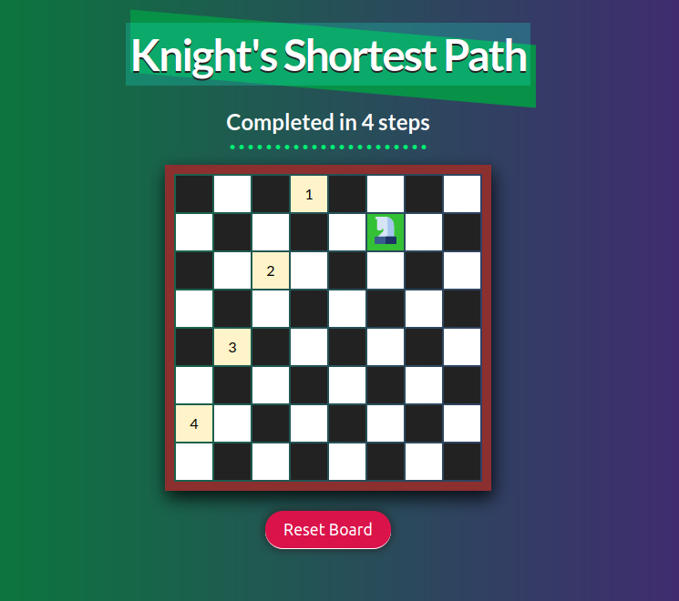

# Knight's Shortest Path - JavaScript

A vanilla JS app that uses a tree data structure to find and display the shortest path for a Knight chess piece to get from point A to point B on the board.

The app makes use of JavaScript OOP principles with pseudo-private methods and properties, and vanilla CSS for rendering a visual representation of the chess board.

## Live Demo

### ✨ [View Live Demo](https://js-knight.netlify.app)

